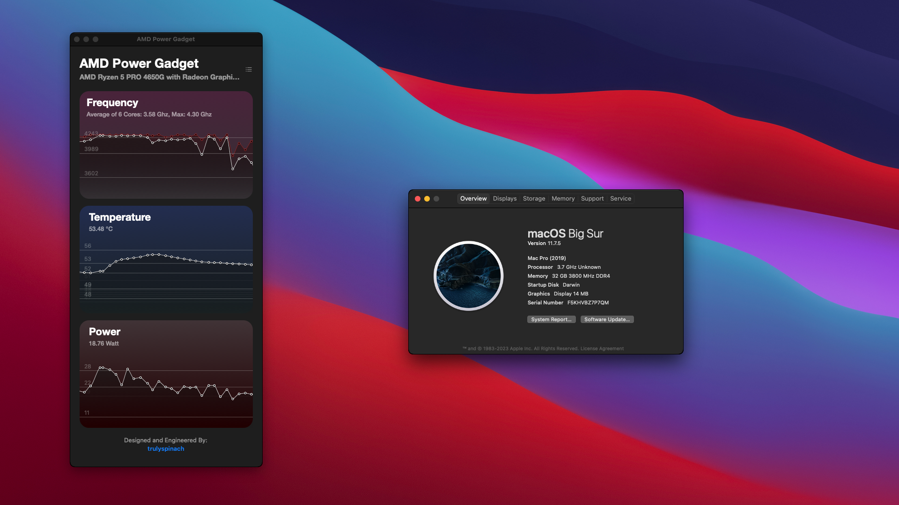

# OpenCore for DeskMini X300 (X300-STX)

- [x] Add ACPI S3 Support  
    - Also being supported since BIOS v[1.80C](https://www.asrock.com/nettop/AMD/DeskMini%20X300%20Series/index.asp#BIOS)
- [ ] Mac OS
    - DP no signal (works after booting up with HDMI)
    - Other NootedRed Issues
 

|Tested|11.7.7(Big Sur)|
|:-|-|
|Release Variants|DEBUG|
|CPU Platform|Ryzen APU|

|System Configuraion|||
|:-|:-:|:-:|
|CPU|4650G|Configured for 6 cores by default, others would need to [modify](https://dortania.github.io/OpenCore-Install-Guide/AMD/zen.html#patch-2) core-related patches|
|Graphics|All Vega integrated-graphics|[NootedRed](https://github.com/NootInc/NootedRed)|
|BIOS|1.8.0E|Enable Resizable BAR and Above 4G Decoding|
|Sound|alcid=11|No Microphone Signal|

